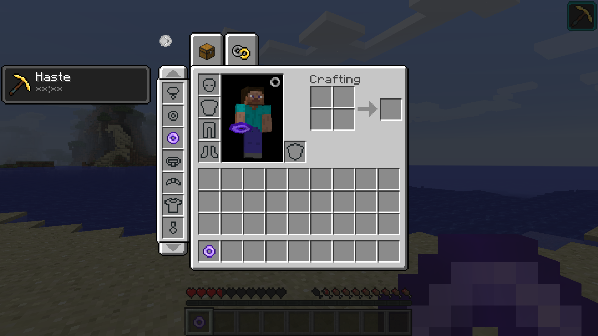
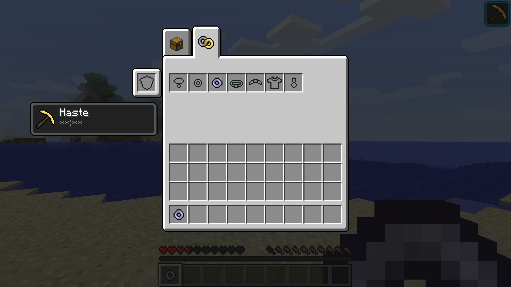

# BaublesEX

### A fork of Baubles.

## What Does This Mod Do

### This mod maintains most functions of **[Baubles](https://github.com/Azanor/Baubles)**:
- Miner's Ring
- bauble slots
- bauble api

### Also add some new functions:

- #### *customizable bauble slots:*
  - customize bauble types and quantities 
  - item can be defined as bauble (todo)

- #### *new style of bauble slots:*
  - now the bauble button can open new slots for baubles beside survival inventory. 
  - add new inventory tab for baubles. now supports a maximum of 27 baubles. support for more slots will be realized in future update. 